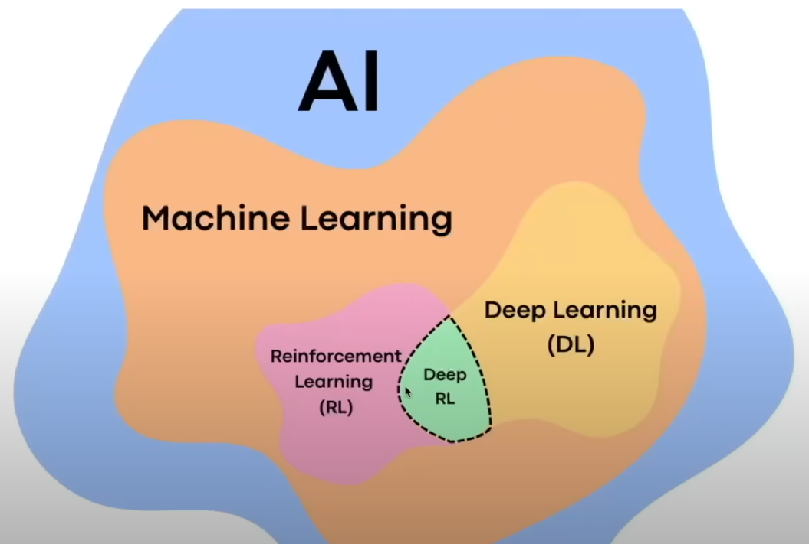
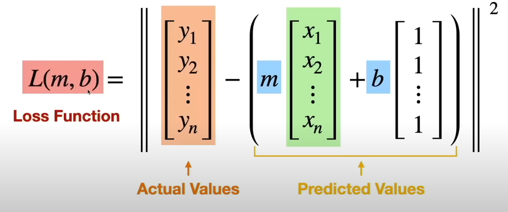
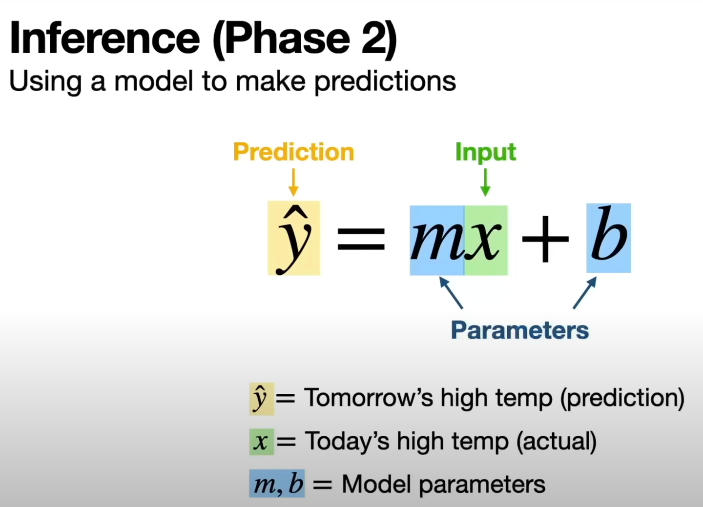
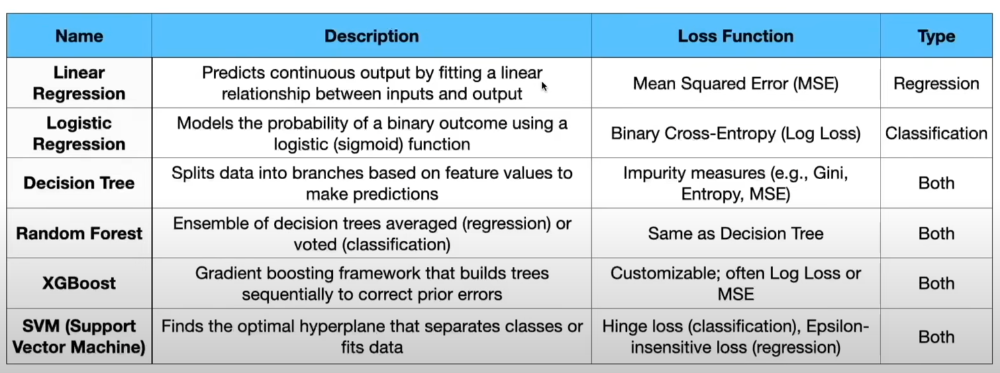
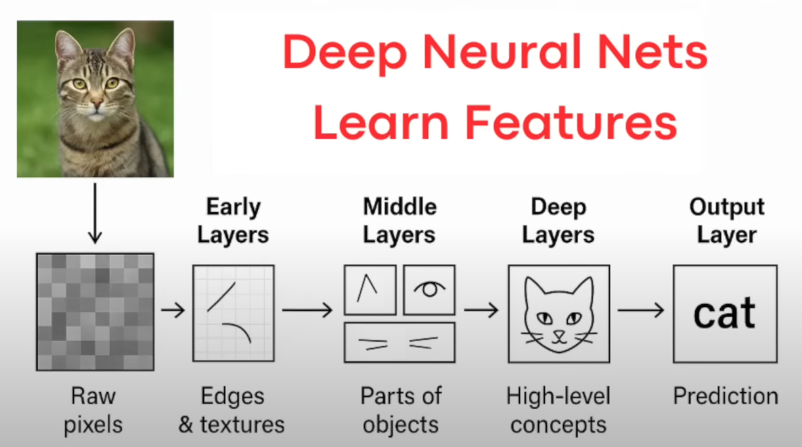
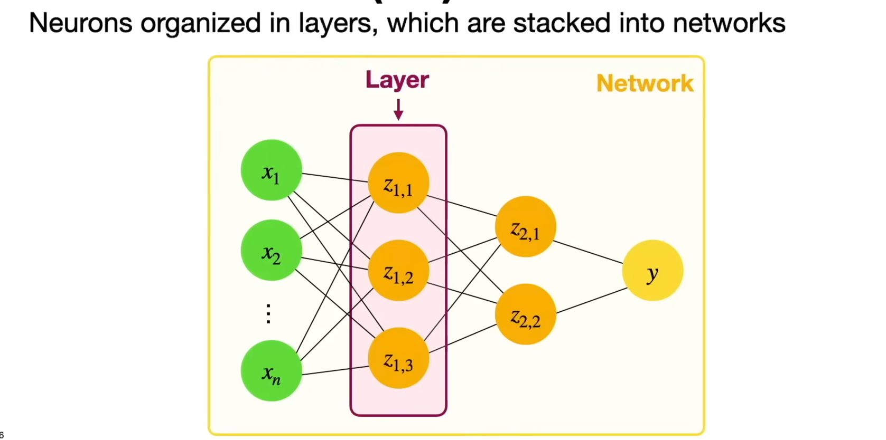
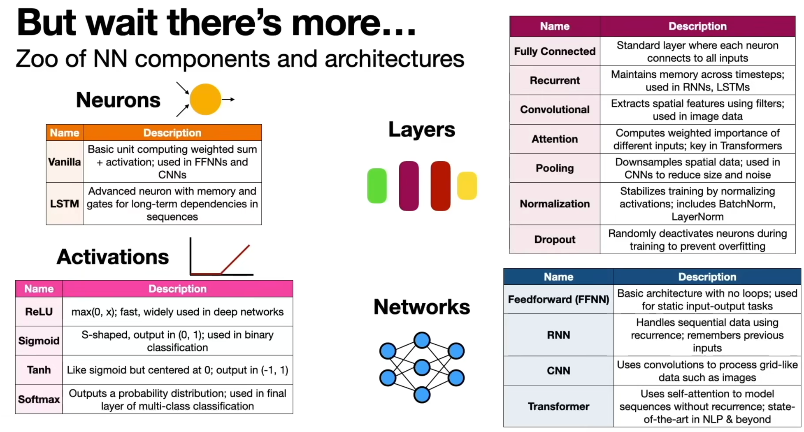
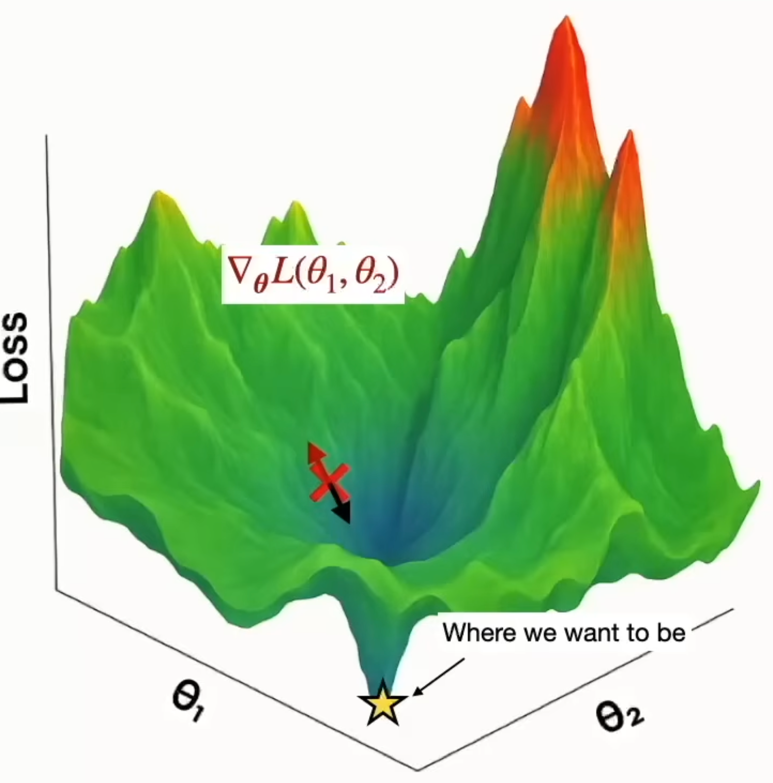
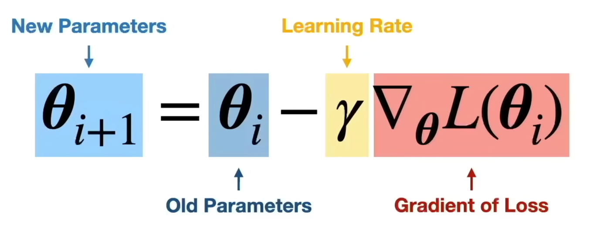
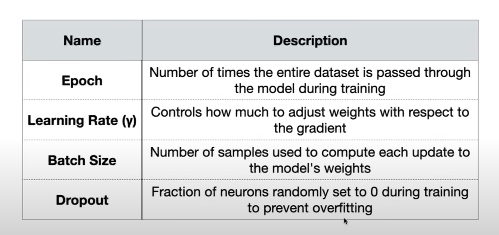

Some way to understand and perceive terms:

**From [ML Foundations for AI Engineers (in 34 Minutes)](https://www.youtube.com/watch?v=BUTjcAjfMgY&t=520s):**

* Read - https://medium.com/data-science-collective/ml-foundations-for-ai-engineers-bda353152d24
* Model - think this as your mental model - which lets you guess/predict things
* Learning - Computer will do something without explicit instruction from human
* AI - A comes first, under this, ML falls then RL, Deep RL, and DL 
* ML - allows computer to learn tasks directly from the data
    * Phase 1 - Trailing --> Learning Algorith --> ML Models
        * Fit a model's predictions to reality
        * By quantifying the discrepancy between the Actual Value and Predicted Values (known as Loss
          Function) 
        * Now goal is to find parameter values with the smallest loss
        * We can get the optimal parameters (for training data) by
          using 
    * Phase 2 - New Data --> ML Model --> Prediction 
    * Key Point: Computer can fit models to reality using data and math
    * Different ways to learn parameters from data (Traditional ML) 
    * Traditional ML - Takes signification time and domain expertise
    * Feature Engineering - Picking the right input variable for ML
* DL - Neural Networks that learns Optimal Features (on their own)
    * Deep Neural Nets Learn Feature 
    * Neural Networks - A series of operations that can approximate (practically) any function
        * It's Building block is Neuron 
        * List[Neurons] -> Layer
        * Networks -> Input --> List[Layer] -->
          Output 
        * There's more 
        * Training Neural Nets: Searching for the parameters with the smallest loss, think this is 3d pane with dips and
          highs - 
        * Gradient Descent - Algorithm for updating parameters to minimize
          loss 
        * More Optimizers - Variation of gradient descent used in
          practice - 
        * Hyperparameters - Values that guide the training process - 
* Reinforcement Learning (RL)
    * Computers learn through trial and error
    * Supervisor Learning (Human Labels the input and model learn from example) Vs Reinforcement Learning (model get
      reward based on the action and learns on its own)
    * Models are not bound by human labelling or expertise
    * Alpha Go - performed better than human, the supervisor model never beat human
* Data
    * More Data > Less Data (Prone to Overfitting)
    * Bad data will always lead to bad model, no matter of the size
    * Accuracy --> Correctness of the data (is imp)
    * Diversity --> Is the data diversity, cover all the cases/scenarios